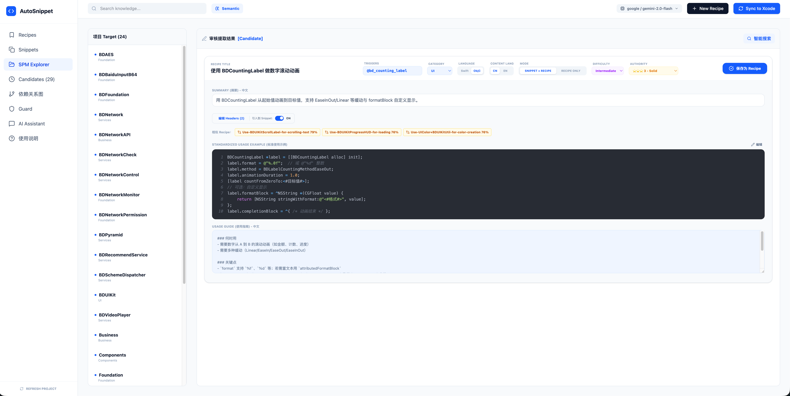

## 起因

2021 年某个周五傍晚写了个 Shell 脚本。

那一周写了太多重复的 Objective-C。UITableView 的初始化模板、网络请求的封装、MVVM 骨架代码，每次新建页面都要去老文件里翻一遍复制粘贴。Xcode 有 Code Snippet 功能，但要一个一个手工加，改了代码还得记着同步。

这算不上什么痛点，顶多是个不爽。但那天打开了 Terminal 写了个 `build.sh`。

思路很简单：在 ObjC 源码的注释里打标记，脚本用 `grep` 找到标记，`sed` 截取代码块，拼成 Xcode 的 `.codesnippet` 文件丢到 Xcode 目录里。重启 Xcode 就能在代码补全里看到自己提取的 snippet。

154 行 Bash。没有依赖没有配置文件没有 README。跑了一下能用，关机回家。

## Node.js 重写

build.sh 在团队里传了一段时间，问题很快出现：同事问标记格式怎么写、能不能加分类、怎么共享。Shell 脚本回答不了这些问题。

于是重写成了 Node.js，发到了 npm 上。CLI 入口命令叫 `asd`，左手食指中指无名指，键盘上最顺手的三个字母。六个命令：init、create、install、share、watch、update。npm 上的描述写的是 *"A iOS module management tool"*，还是个 iOS 工具。

一个人的脚本变成了团队能用的工具。但本质没变，人标记代码、机器提取、写入 IDE，三步。

## AI 来了

然后 Cursor、Copilot 这些东西出现了。AI 写代码很快，但有个根本问题：它不知道你的团队怎么写代码。命名风格不对、错误处理方式不对、架构分层不对。写出来的东西技术上没错，放到代码库里一眼就能看出不是我们的人写的。

花在 Code Review 里纠正 AI 的时间快赶上自己写了。

这时候 2021 年那个老问题换了一种说法冒出来了：如果 AI 能知道我们的编码模式，它写的代码是不是能更好？

和「少写重复代码」是同一个问题，只是规模放大了很多倍。从一个人的 Xcode 变成整个团队的所有 IDE、所有语言、所有 AI 助手。

但要让 AI 知道这些模式，原来的方案全都撑不住了。提取不能靠人工标记，几十万行代码没人一行一行打注释。存储不能是 plist 文件，AI 不读 XML。交付不能写入 Xcode 目录，AI 需要一个协议来实时查询。这个协议到 2024 年才出现，叫 MCP。

## 重建

v1 到 v3 不是升级，差不多是重写。

提取从 `grep` + `sed` 换成了 Tree-sitter WASM，给 9 种语言做了 AST 解析。不再是截取第 47 行到第 63 行的文本，而是真的在解析语法树。上面跑两个 AI Agent 协作：一个判断代码值不值得提取，一个负责结构化加工。154 行 Shell 里没有任何「判断」，grep 到了就提取，现在有一整个管线在评估价值。

存储从散落的 plist 变成了 SQLite + 向量索引。snippet 变成了 Recipe，带结构化标注的知识文档。但 Markdown 文件是真相来源，数据库只是缓存，坏了重建就行。

交付从 `mv` 到 Xcode 目录变成了 MCP 协议，16 个工具暴露给 IDE 里的 AI 按需调用。Cursor、VS Code、Trae 都能接。AI 写代码之前会先查知识库，不用手动复制粘贴。

另外做了个 Guard 引擎，50 多条规则检查代码有没有按规范写。能接 CI 和 git hook，在代码合入前卡住不合规的。

154 行变成 12 万行，1 种语言变成 9 种，1 个 IDE 变成所有支持 MCP 的客户端。但每一步都是上一步撞了墙被逼出来的，不是拍脑袋的发明。

## 做这件事的人为什么这么少

搜过整个 GitHub，做完整链路的同类项目基本没有。有人做 `.cursorrules` 配置收集，有人做 AI Code Review，但从代码里自动提取模式、结构化为知识库、通过 MCP 喂给 AI 这条完整的路，没找到别人在走。

想了想大概有几个原因。

第一，这个想法是一条链不是一个点。需要四步全部到位才有意义：发现模式、结构化提取、知识库管理、AI 实时查询。2021 年做第一步的时候，第三步的 MCP 协议要到 2024 年才出现。

第二，行业选了另一条路。大多数人把「让 AI 写出好代码」定义成 prompt engineering 问题，写更好的规则文件就行了。但手写规则本质上跟 2021 年手动创建 Xcode snippet 一样，覆盖不全、更新滞后、没人愿意长期维护。

第三，时间线不站在你这边。每一步的成熟期不一样。2021 年写 Shell 的时候 Tree-sitter WASM 还没稳定，AST 做到位了 MCP 还没发布，MCP 出来了 LLM 的长上下文能力才刚刚够用。如果 2024 年才起步，前面三年积累的解析器和知识 schema 全是零。

## 现在到了哪里

如果给完成度打个分，大概 69%。

提取能力 72%，9 种语言的解析到位了但精准度还要提升。知识结构化 82%，是所有环节里最成熟的。MCP 交付 68%，通道铺好了但排序和推荐还不够智能。AI 遵循度 55%，这一步最弱——知识喂给 AI 了，AI 有没有真的遵守，还没有系统性的度量。

55% 到 90% 可能比 0 到 55% 更难走。前半程是工程问题，写代码就能解决。后半程要让 AI 真正理解并遵循编码惯例，每一步都在和 LLM 的能力边界博弈。

## 几点感想

**想法不值钱，坚持做才值钱。** 从代码里提取可复用模式这个想法，任何被重复代码烦过的程序员都能想到。但从想到到做出来中间隔着十几次技术迁移和无数个「好像没人需要这个」的怀疑时刻。

**工具会变，问题不会。** grep 被 Tree-sitter 替代，MCP 也不一定是最终形态。但「团队里好的编码模式值得被捕捉和传递」这个问题，只要还有人写代码就不会消失。

**发明常常是需求之母。** 这句话在《枪炮、病菌与钢铁》里看到的，放在这里也成立。2021 年写 build.sh 的时候不知道 AI 会写代码，不知道 MCP 会出现。很多时候不是先有需求再做东西，是东西做着做着需求自己冒出来了。

项目开源，MIT 许可证，从第一天起就没变过。

- GitHub: [github.com/GxFn/AutoSnippet](https://github.com/GxFn/AutoSnippet)
- npm: `npm install -g autosnippet`
- 技术架构解析: [docs.gaoxuefeng.com](https://docs.gaoxuefeng.com)

